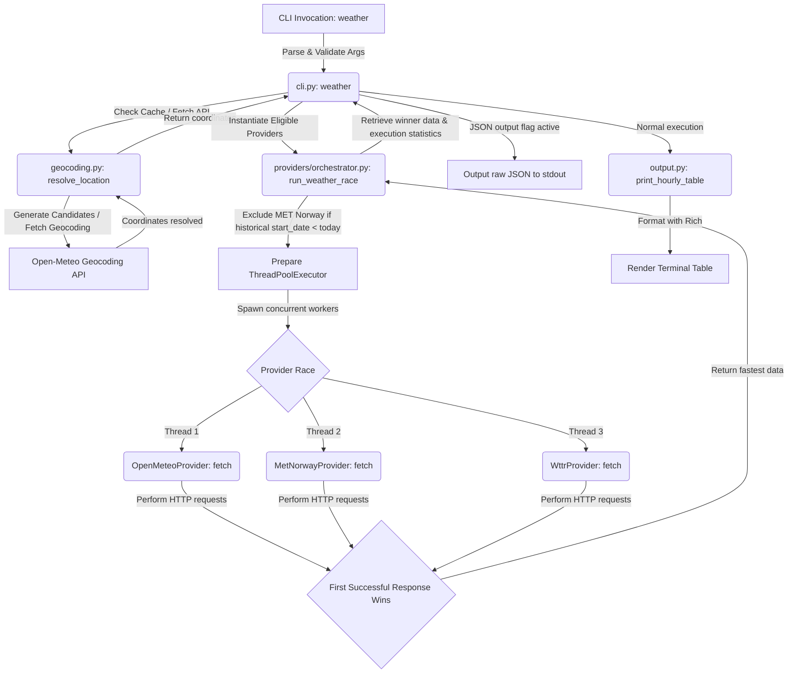
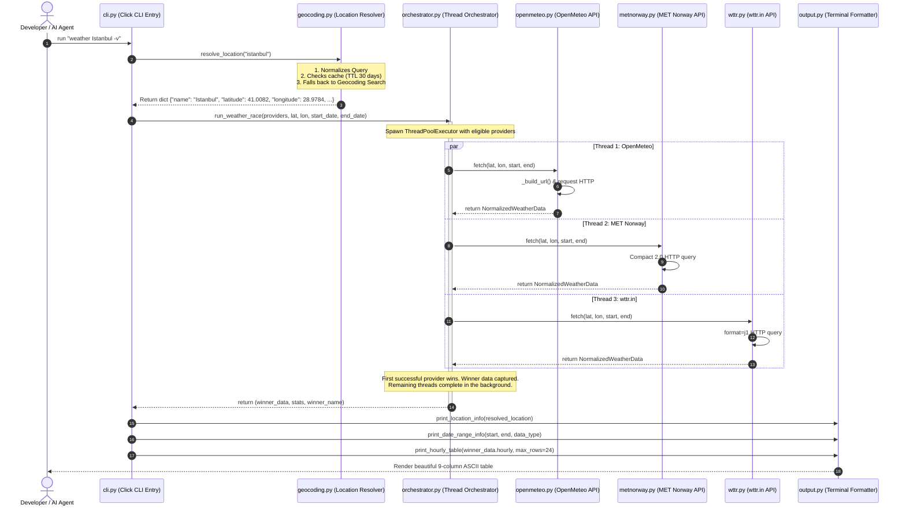

# Weather CLI — Core Developer & AI Architecture Documentation

> **Last Modified Date:** 2026-05-19T14:55:50+03:00  
> **Target Audience:** Core Developers / AI Agents  
> **System Version:** 1.0.0  
> **Language Compatibility:** Python ≥ 3.9  

---

## Table of Contents

1. [System Architecture Overview](#1-system-architecture-overview)
2. [Module Reference Guide](#2-module-reference-guide)
   - [Entry Point: `cli.py`](#21-entry-point-clipy)
   - [Geocoding & Cache: `geocoding.py`](#22-geocoding--cache-geocodingpy)
   - [Provider Interface & Models: `providers/base.py`, `providers/models.py`](#23-provider-interface--models-providersbasepy-providersmodelspy)
   - [Parallel Orchestrator: `providers/orchestrator.py`](#24-parallel-orchestrator-providersorchestratorpy)
   - [Provider Implementations: `openmeteo.py`, `metnorway.py`, `wttr.py`](#25-provider-implementations-openmeteopy-metnorwaypy-wttrpy)
   - [Formatting & Rendering: `output.py`](#26-formatting--rendering-outputpy)
3. [Core Algorithms & Logical Workflows](#3-core-algorithms--logical-workflows)
   - [Geocoding Candidate Generation & ASCII Folding](#31-geocoding-candidate-generation--ascii-folding)
   - [Geocoding Cache Layer](#32-geocoding-cache-layer)
   - [Parallel Weather Race (The Orchestrator)](#33-parallel-weather-race-the-orchestrator)
   - [Date Ranges, Historical Filters & Exclusions](#34-date-ranges-historical-filters--exclusions)
4. [Data Schemas & Normalization Rules](#4-data-schemas--normalization-rules)
   - [Internal Normalized Models](#41-internal-normalized-models)
   - [Mapping Provider Emojis (WMO Standard)](#42-mapping-provider-emojis-wmo-standard)
5. [Visual Formatting Rules](#5-visual-formatting-rules)
   - [Temperature Colors](#51-temperature-colors)
   - [Wind Compass Interpolation](#52-wind-compass-interpolation)
   - [Hourly Table Structure](#53-hourly-table-structure)
6. [Testing & Verification Suite](#6-testing-&amp;-verification-suite)
7. [Operational Guidelines for AI Agents](#7-operational-guidelines-for-ai-agents)

---

## 1. System Architecture Overview

The **Weather CLI** is structured as an extremely decoupled, thread-safe, and high-performance command-line application. It is designed to resolve arbitrary location queries, execute concurrent HTTP racing queries across multiple meteorological providers, and display clean, rich-formatted tables or structured JSON payloads.

### Architectural Flowchart

This diagram illustrates the step-by-step sequence of execution from the command invocation to the final rendering block:



### Component Interaction Sequence

The following sequence diagram provides details on method invocations, data models passed, and concurrent racing lifetimes:



---

## 2. Module Reference Guide

### 2.1. Entry Point: `cli.py`

This module manages command-line parsing, argument validation, geocoding lookups, runtime performance statistics, and controls the primary flow of execution.

#### Important Functions & Callbacks

*   **`validate_date(ctx, param, value) -> Optional[str]`**
    *   **Description:** Callback used by Click to strictly validate the dates passed to `--from-date` and `--to-date`.
    *   **Input parameters:** 
        *   `ctx`: Click context object.
        *   `param`: Parameter configuration object.
        *   `value`: String to validate.
    *   **Logic:** Attempts to parse `value` using `datetime.strptime(value, "%Y-%m-%d")`.
    *   **Exceptions Raised:** `click.BadParameter` if the string cannot be parsed as an ISO YYYY-MM-DD date.
    *   **Returns:** Unchanged `value` on success.

*   **`weather(location, from_date, to_date, all_hours, json_output, verbose)`**
    *   **Description:** Click-decorated command defining the execution cycle.
    *   **Parameters:**
        *   `location` (str): Raw place search text.
        *   `from_date` (str): Optional YYYY-MM-DD start range. Defaults to today's date if `None`.
        *   `to_date` (str): Optional YYYY-MM-DD end range. Defaults to today's date if `None`.
        *   `all_hours` (bool): Flag indicating whether to print full hourly records.
        *   `json_output` (bool): Flag indicating whether to output raw json serialization to stdout.
        *   `verbose` (bool): Flag showing cache lookup details, concurrent execution latencies, and thread statistics.
    *   **Execution Stages:**
        1.  Normalizes default dates (today's string via `date.today().strftime("%Y-%m-%d")`).
        2.  If `verbose` is enabled, checks the geocoding cache file for an entry mapping to the lowercase query key to print `⚡ Cache Hit` or `🔍 Cache Miss` in the terminal.
        3.  Resolves location into a coordinate dictionary via `resolve_location()`.
        4.  Sets up a standard list of concrete providers: `OpenMeteoProvider()`, `MetNorwayProvider()`, and `WttrProvider()`.
        5.  Initiates `run_weather_race(...)` which concurrently queries providers.
        6.  If `verbose`, prints step-by-step thread execution metrics (`time_ms`, `success`, `error`) and details the race winner.
        7.  If `json_output`, uses standard `dataclasses.asdict` on the winner, appends the resolved location dictionary under `"resolved_location"`, and prints a formatted JSON block.
        8.  Otherwise, formats output sections via `print_location_info()`, `print_date_range_info()`, and `print_hourly_table()`.

---

### 2.2. Geocoding & Cache: `geocoding.py`

This module provides high-resilience geocoding logic, query normalization permutations, fallback candidate chains, coordinate rounding, and disk-caching mechanisms.

#### Constants

*   `CACHE_PATH`: Absolute filepath located at `~/.cache/weather_cli/geo_cache.json`.
*   `CACHE_TTL_SECONDS`: Caching time-to-live parameter set to `30 * 24 * 60 * 60` (exactly 30 days).
*   `_PREFIXES_TO_STRIP`: Directional and temporal prefix set: `{"eski", "yeni", "new", "old", "upper", "lower", "north", "south", "east", "west"}`.

#### Primary Functions

*   **`_ascii_fold(text: str) -> str`**
    *   Normalizes strings by decomposing complex accents, diacritics, and symbols. Converts letters to their standard ASCII counterparts using `NFKD` decomposition.
    *   *Implementation:* `unicodedata.normalize("NFKD", text).encode("ascii", "ignore").decode("ascii")`

*   **`_normalize_query(query: str) -> list[str]`**
    *   Generates a prioritized list of search variants to feed sequentially into the geocoding service.
    *   *Steps:*
        1. Splitting the query string by whitespace. If the first word is in `_PREFIXES_TO_STRIP`, it creates a stripped variation.
        2. Splitting by commas to separate city names from country identifiers, generating token lists.
        3. Appending ASCII-folded variations of the unique candidates to protect against non-ASCII service search errors.
    *   *Returns:* Deduplicated lists containing candidates starting from the most specific down to the most generic fallback query.

*   **`resolve_location(query: str) -> dict`**
    *   Resolves a raw string to coordinates, checking caches and fallback candidates.
    *   *Steps:*
        1. Looks up `query.lower().strip()` within `geo_cache.json`. If a record exists and `time.time() - entry["timestamp"] < CACHE_TTL_SECONDS`, returns the cached coordinates immediately.
        2. If cached value is missing or expired, iterates over candidates generated by `_normalize_query()`.
        3. Queries Open-Meteo Geocoding Search API.
        4. On response, takes the best (first) result, rounds coordinates to **4 decimal places**, saves results to `geo_cache.json` with a fresh timestamp, and returns:
           ```python
           {
               "name": str,
               "latitude": float,
               "longitude": float,
               "country": str,
               "admin1": str
           }
           ```
        5. Raises `ValueError("Location not found")` if no candidates return a match.

---

### 2.3. Provider Interface & Models: `providers/base.py`, `providers/models.py`

This module houses the dataclasses for our internal domain representation and our abstract provider base.

#### Abstract Interface: `BaseWeatherProvider`

Requires child implementations to declare:
*   `@property def name() -> str`: Standard user-facing string.
*   `def fetch(lat: float, lon: float, start_date: str, end_date: str) -> NormalizedWeatherData`: Fetches weather data.

#### Domain Dataclasses

```python
@dataclass
class HourlyPoint:
    time: str                      # ISO standard datetime "YYYY-MM-DDTHH:MM" (UTC)
    temperature: float             # In °C
    apparent_temperature: float    # In °C (Feels like)
    precipitation_probability: float  # In %
    precipitation: float           # In mm (liquid equivalent)
    humidity: float                # Relative humidity in %
    wind_speed: float              # Wind speed in km/h
    wind_direction: float          # Angular degrees (0° - 360°)
    cloud_cover: float             # Cloud coverage percentage (0% - 100%)
    weather_code: int              # Standardized WMO Weather Code

@dataclass
class NormalizedWeatherData:
    provider_name: str
    hourly: List[HourlyPoint] = field(default_factory=list)
```

---

### 2.4. Parallel Orchestrator: `providers/orchestrator.py`

Performs concurrent network requests across different providers, evaluating performance metrics and picking the fastest successful thread.

#### Primary Function: `run_weather_race`

```python
def run_weather_race(
    providers: List[BaseWeatherProvider],
    lat: float,
    lon: float,
    start_date: str,
    end_date: str
) -> Tuple[NormalizedWeatherData, Dict[str, Any], str]
```

*   **Logic Sequence:**
    1.  Determines if queries involve historical dates by evaluating `date.fromisoformat(start_date) < date.today()`.
    2.  Filters out the `MET Norway` provider if historical requests are active (due to lacking archive APIs).
    3.  If no providers remain, throws a `ValueError`.
    4.  Initializes a `ThreadPoolExecutor` with a pool sized to match eligible providers.
    5.  Wraps each provider request in a tracker method:
        ```python
        def run_task(p=provider):
            start_time = time.perf_counter()
            try:
                res = p.fetch(lat, lon, start_date, end_date)
                elapsed = (time.perf_counter() - start_time) * 1000.0
                return p.name, res, elapsed, None
            except Exception as ex:
                elapsed = (time.perf_counter() - start_time) * 1000.0
                return p.name, None, elapsed, str(ex)
        ```
    6.  Monitors execution using `as_completed()`.
    7.  **First-completed success wins:** As soon as any thread yields a successful result (`res is not None`), that response is selected as the winner, the winner's details are stored, and the loop is terminated.
    8.  Remaining threads are left to complete background execution, preventing blocked main process loops.
    9.  If all providers return failures, aggregates individual execution traceback errors into a `ConnectionError` and exits.

---

### 2.5. Provider Implementations: `openmeteo.py`, `metnorway.py`, `wttr.py`

#### 2.5.1. OpenMeteoProvider (`openmeteo.py`)

*   **API Selection Logic:**
    *   **Forecast (future queries):** `https://api.open-meteo.com/v1/forecast`
    *   **Archive (historical queries):** `https://archive-api.open-meteo.com/v1/archive`
    *   If query spans past and future dates (relative to `date.today()`), performs parallel-like subqueries to both Forecast and Archive backends, then merges their JSON arrays.
*   **Response Normalization:** Iterates over the lists in the `"hourly"` dictionary (`time`, `temperature_2m`, `relative_humidity_2m`, etc.) and maps them directly to `HourlyPoint` instances.

#### 2.5.2. MetNorwayProvider (`metnorway.py`)

*   **Endpoint:** `https://api.met.no/weatherapi/locationforecast/2.0/compact`
*   **Header Compliance:** Sets a specific user-agent required by MET Norway's TOS to avoid 403 Forbidden blocks: `"User-Agent": "weather-cli/0.1.0 contact@example.com"`.
*   **Response Normalization:**
    *   Iterates through nested points in `.properties.timeseries`.
    *   Extracts temperature and relative humidity directly.
    *   Converts wind speed from meters per second to kilometers per hour: `wind_speed_kmh = wind_speed_ms * 3.6`.
    *   Falls back `apparent_temperature` to the standard air temperature since the compact model does not provide a separate apparent temperature field.
    *   Converts symbol codes (e.g. `clearsky_day`) to standard WMO codes using `SYMBOL_TO_WMO`.

#### 2.5.3. WttrProvider (`wttr.py`)

*   **Endpoint:** `https://wttr.in/{lat},{lon}?format=j1`
*   **Response Normalization:**
    *   wttr.in returns forecast data in 3-hourly blocks.
    *   To keep structural consistency across outputs, wttr.in's 3-hourly blocks are expanded to 24-hourly points (00:00 to 23:00) by duplicating properties for intra-block hours: `block_idx = min(h // 3, len(hourly_blocks) - 1)`.
    *   Converts WWO codes to WMO codes using `WWO_TO_WMO` mapping.

---

### 2.6. Formatting & Rendering: `output.py`

Converts normalized data into highly polished terminals with specific columns, colors, and unicode tables.

*   **`print_hourly_table(hourly_points: List[HourlyPoint], max_rows: int = 24)`**
    *   Renders exactly 9 columns as defined by the system layout:
        1.  `Time` (Format: `HH:MM` or `DD HH:MM` for multi-day queries).
        2.  `Temp (°C)` (Colorized using `_get_temp_color()`).
        3.  `Feels (°C)` (Feels-like apparent temperature).
        4.  `Precip Prob (%)` (Precipitation probability).
        5.  `Precip (mm)` (Precipitation amount, displays `-` if exactly `0.0`).
        6.  `Humidity (%)` (Relative humidity percentage).
        7.  `Wind` (Combines wind speed and compass direction: e.g., `15 NE`).
        8.  `Cloud (%)` (Total cloud coverage percentage).
        9.  `Weather` (Combines emoji and textual descriptions mapping to WMO codes).
    *   Handles row count caps (24 default, 168 max with `--all-hours`).

---

## 3. Core Algorithms & Logical Workflows

### 3.1. Geocoding Candidate Generation & ASCII Folding

The normalization workflow in `geocoding.py` ensures that users and AI agents can supply non-standard strings, localized characters, or compound phrases and still get accurate geocoding lookups.

```
                  ┌───────────────────────────────┐
                  │      Raw Input Search         │
                  │   e.g., "Eski İstanbul"      │
                  └───────────────┬───────────────┘
                                  │
                                  ▼
                     [Step 1: Prefix Stripping]
               Strips prefixes like "Eski", "New"...
               Candidate generated: "İstanbul"
                                  │
                                  ▼
                       [Step 2: Tokenization]
              Splits commas and whitespaces into list
              Candidate generated: ["İstanbul", "Eski", "İstanbul"]
                                  │
                                  ▼
                       [Step 3: ASCII Folding]
             Decomposes characters to ASCII equivalents
             "İstanbul" -> "Istanbul"
             Candidate generated: ["Istanbul"]
                                  │
                                  ▼
                      [Step 4: De-duplication]
             Removes duplicate tokens and formats lists
             Final Ordered Candidates:
             1. "İstanbul" (Stripped)
             2. "Eski İstanbul" (Original)
             3. "İstanbul" (Tokenized)
             4. "Istanbul" (ASCII Folded)
```

---

### 3.2. Geocoding Cache Layer

To reduce API calls and latency, `geocoding.py` caches resolved queries in `~/.cache/weather_cli/geo_cache.json`:

```json
{
  "istanbul": {
    "data": {
      "name": "Istanbul",
      "latitude": 41.0082,
      "longitude": 28.9784,
      "country": "Turkey",
      "admin1": "Istanbul"
    },
    "timestamp": 1779239750.123
  }
}
```

*   **Cache Write:** Serializes the coordinate dictionary and write time when a search succeeds.
*   **Cache Read:** Performs lookup on lowercase trimmed strings.
*   **TTL Guard:** `time.time() - entry["timestamp"] < CACHE_TTL_SECONDS (30 days)`. If expired, invalidates the cache entry and triggers a fresh network search.

---

### 3.3. Parallel Weather Race (The Orchestrator)

The thread orchestrator initiates a concurrent race across eligible providers using `ThreadPoolExecutor`:

```
Main CLI Process                       Worker Threads (ThreadPoolExecutor)
   │
   ├─► Spawn Threads ──────────────────┐
   │                                   │  (Thread 1: Open-Meteo API)
   │                                   ├─► [fetch: lat, lon] ───► HTTP GET
   │                                   │
   │                                   │  (Thread 2: MET Norway API)
   │                                   ├─► [fetch: lat, lon] ───► HTTP GET
   │                                   │
   │                                   │  (Thread 3: wttr.in API)
   │                                   └─► [fetch: lat, lon] ───► HTTP GET
   │
   ├─► as_completed() Loop
   │     │
   │     ├─► Thread 1 completes in 120ms (Success!)
   │     │   - winner_data = Thread 1
   │     │   - winner_name = "Open-Meteo"
   │     │   - Immediately break loop and return.
   │     │
   │     └─► Thread 2 and 3 continue running in the background.
   │
   ▼
Render Output
```

---

### 3.4. Date Ranges, Historical Filters & Exclusions

The system classifies query date windows into three distinct states to determine provider eligibility and route API requests:

1.  **Forecast (`start_date >= today`):**
    *   Eligible Providers: Open-Meteo, MET Norway, wttr.in.
    *   API Endpoint: Open-Meteo Forecast API (`/v1/forecast`).
2.  **Historical (`end_date < today`):**
    *   Eligible Providers: Open-Meteo, wttr.in.
    *   **Exclusion Rules:** MET Norway is dynamically skipped because it lacks an archive backend.
    *   API Endpoint: Open-Meteo Archive API (`/v1/archive`).
3.  **Mixed (`start_date < today <= end_date`):**
    *   Eligible Providers: Open-Meteo, wttr.in (MET Norway excluded).
    *   API Endpoint: Subqueries both Open-Meteo Forecast and Archive backends, merging their hourly values into a continuous dataset.

---

## 4. Data Schemas & Normalization Rules

### 4.1. Internal Normalized Models

Every backend adapter converts raw provider JSON payloads into our strict dataclasses:

| Target Property | Typings | Metrics / Ranges | Normalization Strategy / Safe fallbacks |
| :--- | :--- | :--- | :--- |
| `time` | `str` | ISO 8601 (UTC) | Removes local characters; drops `Z` offsets. |
| `temperature` | `float` | Celsius (°C) | Coerces to floats; falls back to `0.0` if null. |
| `apparent_temperature`| `float` | Celsius (°C) | Falls back to standard air temperature if missing. |
| `precipitation_probability`| `float` | `0.0` to `100.0` (%) | Coerces to floats; defaults to `0.0`. |
| `precipitation` | `float` | Millimeters (mm) | Defaults to `0.0` if no liquid precipitation. |
| `humidity` | `float` | `0.0` to `100.0` (%) | Standard relative humidity. |
| `wind_speed` | `float` | km/h | Converts MET Norway (m/s) to km/h: `ms * 3.6`. |
| `wind_direction` | `float` | `0.0` to `360.0` (deg) | Compass degrees; defaults to `0.0`. |
| `cloud_cover` | `float` | `0.0` to `100.0` (%) | Standard percentage representation. |
| `weather_code` | `int` | WMO Weather Codes | Maps provider-specific codes to standard WMO codes. |

---

### 4.2. Mapping Provider Emojis (WMO Standard)

`output.py` uses the standard **WMO Weather Code** mapping list to translate integers into appropriate visual emojis and descriptions:

```python
WEATHER_CODES = {
    0: ("☀️", "Clear"),
    1: ("🌤️", "Mainly clear"),
    2: ("⛅", "Partly cloudy"),
    3: ("☁️", "Overcast"),
    45: ("🌫️", "Fog"),
    48: ("🌫️", "Depositing rime fog"),
    51: ("🌦️", "Light drizzle"),
    53: ("🌦️", "Moderate drizzle"),
    55: ("🌦️", "Dense drizzle"),
    56: ("🌦️", "Light freezing drizzle"),
    57: ("🌦️", "Dense freezing drizzle"),
    61: ("🌧️", "Slight rain"),
    63: ("🌧️", "Moderate rain"),
    65: ("🌧️", "Heavy rain"),
    66: ("🌧️", "Light freezing rain"),
    67: ("🌧️", "Heavy freezing rain"),
    71: ("🌨️", "Slight snow"),
    73: ("🌨️", "Moderate snow"),
    75: ("🌨️", "Heavy snow"),
    77: ("🌨️", "Snow grains"),
    80: ("🌧️", "Slight rain showers"),
    81: ("🌧️", "Moderate rain showers"),
    82: ("🌧️", "Violent rain showers"),
    85: ("🌨️", "Slight snow showers"),
    86: ("🌨️", "Heavy snow showers"),
    95: ("⛈️", "Thunderstorm"),
    96: ("⛈️", "Thunderstorm with slight hail"),
    99: ("⛈️", "Thunderstorm with heavy hail"),
}
```

*   **Fallback Strategy:** Any unknown codes resolve to `("❓", "Unknown")`.

---

## 5. Visual Formatting Rules

### 5.1. Temperature Colors

Temperatures are styled using color tags:

| Degrees Condition | Render Color | Target Style |
| :--- | :--- | :--- |
| `temp <= 5` | **Blue** | `[blue]` |
| `5 < temp <= 15` | **Green** | `[green]` |
| `temp > 15` | **Red** | `[red]` |

*   *Implementation:*
    ```python
    def _get_temp_color(temp: float) -> Text:
        if temp <= 5:
            return Text(str(round(temp)), style="blue")
        elif temp <= 15:
            return Text(str(round(temp)), style="green")
        else:
            return Text(str(round(temp)), style="red")
    ```

---

### 5.2. Wind Compass Interpolation

To transform wind direction degrees ($0^{\circ}$ to $360^{\circ}$) into readable compass headings:

$$\text{Index} = \text{round}\left(\frac{\text{Degrees}}{45}\right) \pmod 8$$

*   **Directions Map:** `["N", "NE", "E", "SE", "S", "SW", "W", "NW"]`
*   *Example:* A wind direction of $48^{\circ}$ evaluates to $\text{round}(48/45) \pmod 8 = 1$, mapping directly to `"NE"`.

---

### 5.3. Hourly Table Structure

The `print_hourly_table` function displays a clean **9-column table** in the terminal:

```
                          Hourly Weather
 Time   Temp   Feels   Precip   Precip   Humidity     Wind     Cloud     Weather
        (°C)    (°C)  Prob (%)   (mm)      (%)                  (%)
────────────────────────────────────────────────────────────────────────────────
00:00    15      14      10       -         70       12 NE      20    ☀️ Clear
01:00    15      14      20      0.2        75       11 NE      40    🌤️ Mainly clear
```

---

## 6. Testing & Verification Suite

Our test suite is written using `pytest` and features comprehensive mock assertions to keep verification isolated and fast.

### Test Files & Covered Scenarios

1.  **`tests/test_cli.py`**
    *   **`test_cli_normal_output`**: Mocks geocoding and the orchestrator race to verify standard tables are printed without daily summaries.
    *   **`test_cli_verbose_output`**: Validates that running with `--verbose` prints parallel race logs, cache information, and winner timings.
    *   **`test_cli_json_output`**: Ensures `--json-output` produces a valid, parsable JSON string on stdout containing exact keys.
2.  **`tests/test_geocoding.py`**
    *   **`test_coordinate_truncation`**: Confirms that latitude and longitude coordinates are rounded to exactly **4 decimal places**.
    *   **`test_geocoding_cache_hit_and_ttl`**: Mocks the geocoding fetch API to verify that cache hits return values instantly without making network calls.
    *   **`test_geocoding_cache_miss_ttl_expired`**: Simulates expired TTL values (e.g. 31 days) to confirm that the cache layer falls back to network requests.
3.  **`tests/test_orchestrator.py`**
    *   **`test_race_fastest_wins`**: Simulates concurrent threads with artificial delays to ensure the fastest provider wins.
    *   **`test_race_handles_failure_falls_back`**: Simulates a fast thread failing to ensure the orchestrator falls back to the slower successful provider.
    *   **`test_race_historical_guard_excludes_metnorway`**: Mocks dates to verify that past queries exclude MET Norway from the execution plan.
    *   **`test_race_all_fail`**: Ensures that when all providers fail, a clean connection error is raised.
4.  **`tests/test_providers.py`**
    *   **`test_openmeteo_provider`**: Feeds mock responses into `OpenMeteoProvider` to verify mapping logic.
    *   **`test_metnorway_provider`**: Verifies that wind speed conversions (m/s to km/h) and apparent temperature fallback rules function correctly.
    *   **`test_wttr_provider`**: Ensures that wttr.in's 3-hourly blocks are correctly expanded into 24-hourly points.

### Running the Test Suite

Execute the following commands from the workspace root to run tests:

```bash
# Run all tests using pytest
pytest -v

# Run with coverage reports
pytest --cov=weather_cli tests/
```

---

## 7. Operational Guidelines for AI Agents

When interacting with or calling this tool, AI agents should adhere to the following rules:

### 1. Programmatic Integrations
*   **Always use the `-j` / `--json-output` flag.** This bypasses terminal escape sequences, emojis, and styling, and returns a clean, structured JSON payload.
*   Pipe JSON output directly into query utilities like `jq` to isolate specific values:
    ```bash
    weather Istanbul -j | jq '.hourly[0].temperature'
    ```

### 2. Error Mitigation
*   **Ensure strict date validation.** Start and end dates must conform to `YYYY-MM-DD`. Using other formats will cause the CLI to exit with code `1`.
*   **Check date chronological order.** If `from-date` is set to a date after `to-date` (e.g. `-f 2026-05-25 -t 2026-05-19`), the APIs will return empty lists. The CLI passes these parameters directly to the API without raising errors, which results in empty output tables.
*   **Handle future forecast boundaries.** If you request dates beyond `today + 16 days`, the Forecast API will cap results at its limit.

### 3. Machine-Readable Schema (JSON Structure)
When querying in JSON mode, the output matches this schema:

```json
{
  "provider_name": "Open-Meteo",
  "hourly": [
    {
      "time": "2026-05-19T00:00",
      "temperature": 15.2,
      "apparent_temperature": 14.0,
      "precipitation_probability": 10.0,
      "precipitation": 0.0,
      "humidity": 70.0,
      "wind_speed": 12.0,
      "wind_direction": 45.0,
      "cloud_cover": 20.0,
      "weather_code": 0
    }
  ],
  "resolved_location": {
    "name": "Istanbul",
    "latitude": 41.0082,
    "longitude": 28.9784,
    "country": "Turkey",
    "admin1": "Istanbul"
  }
}
```
