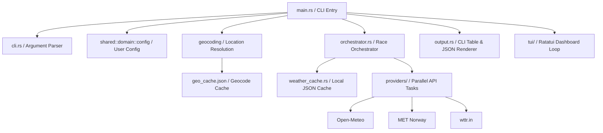

# System Architecture

This document describes the high-level software architecture, data flow, and components of the Weatheroz & TUI application.

---

## 🏛️ High-Level Design

The project is structured with strict separation between logic, external APIs, and presentation (CLI & TUI). Here is the conceptual module relationship:

---

## 🔄 Core Components

### 1. Parallel Race Orchestrator (`src/orchestrator.rs`)
To achieve peak performance and resilience, the orchestrator performs a parallel "race":
- It spawns concurrent asynchronous tasks for each eligible provider (`OpenMeteo`, `MetNorway`, `wttr`).
- The fastest successful response instantly fulfills the orchestrator's promise.
- The details of thread run times are logged in verbose mode, proving the speedups.
- **Resilience**: If all providers fail or if the system is completely offline, the orchestrator automatically intercepts the failure and falls back to loading the last saved weather state from cache.

### 2. Local Weather & Geocoding Caches (`src/weather_cache.rs`, `src/geocoding/`)
- **Weather Cache**: Persists weather forecast arrays locally under `.cache/weatheroz/weather_cache.json` with a 15-minute validity window. Stale cache is refreshed, but kept as a fallback during network failures.
- **Geocoding Cache**: Resolves and maps location search queries (like "London") to GPS coordinates. Resolving coordinates is cached for up to 30 days (`geo_cache.json`) to bypass redundant geocoding API queries.
- **IP Detection**: When location is omitted, the IP geocoder contacts an external API to resolve the device's current public IP to a geographical city.

### 3. API Providers (`src/providers/`)
Each provider implements a clean interface to fetch and parse weather details into a unified standard weather data model:
- **Open-Meteo**: Highly granular hourly metrics.
- **MET Norway**: Standard forecast service (historical dates are filtered out as MET Norway does not support them).
- **wttr.in**: Text-based fallback providing great coverage.

### 4. Interactive Terminal User Interface (`src/tui/`)
When the application is run in interactive mode (when stdout is a terminal and JSON is not requested):
- The program switches to a raw alternate terminal screen using `crossterm`.
- A background worker thread executes geocoding and the parallel orchestrator race.
- An interactive dashboard loops, rendering current temperature, active wind speeds, precipitation forecast tables, and a **Live System Logs panel**.
- Tracing is wired directly into the TUI using a custom `tracing_subscriber` layer (`TuiLoggingLayer`), displaying real-time system logs straight on screen without cluttering stdout.
