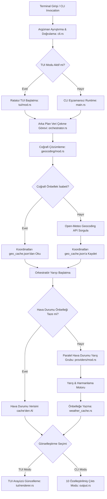
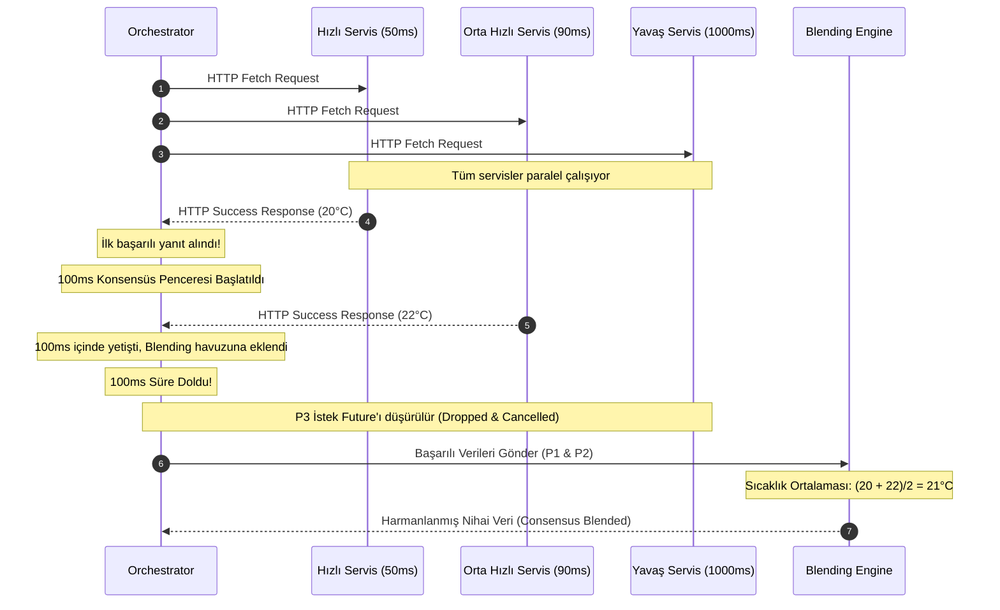

# Hava Durumu CLI - Teknik Mimari ve Sistem Tasarımı Dokümanı

Bu doküman, **Hava Durumu CLI** uygulamasının mimarisini, eşzamanlılık (concurrency) modelini, veri harmanlama motorunu, veri yapılarını ve modüler yapısını detaylı bir şekilde açıklamaktadır. 

Uygulama, yüksek performanslı, tek bir taşınabilir ikili dosyadan (single portable binary) oluşan, milisaniyeler seviyesinde açılış hızına sahip ve düşük kaynak tüketen modern bir Rust tasarımıdır.

---

## 1. Genel Sistem Mimarisi

Hava Durumu CLI, modüler bir katman yapısına sahiptir. Kullanıcının terminalden komutu vermesinden itibaren verinin getirilmesi, işlenmesi ve görselleştirilmesi süreci belirli aşamalardan geçer.

### 1.1. Mimarî Blok Diyagramı

Aşağıdaki şemada uygulamanın genel veri akışı ve bileşenlerin birbiriyle etkileşimi gösterilmektedir:

---

## 2. Temel Modüller ve Sorumlulukları

Uygulamanın kaynak kodları, SOLID prensiplerine ve Tek Sorumluluk İlkesine (Single Responsibility Principle) uygun şekilde bölünmüştür:

| Modül / Dosya | Sorumluluk Alanı | Temel Yapılar & Fonksiyonlar |
| :--- | :--- | :--- |
| **`src/main.rs`** | Uygulama giriş kapısıdır. Eşzamansız Tokio çalışma ortamını (`tokio::main`) ayağa kaldırır, CLI ve TUI modları arasındaki yönlendirmeyi yapar. | `main()` |
| **`src/cli.rs`** | `clap` kütüphanesini kullanarak komut satırı parametrelerini ayrıştırır, doğrular ve yardım (`--help`) ekranını yönetir. | `Args` yapısı |
| **`src/orchestrator.rs`** | Geocoding çözümlemesi, önbellek kontrolleri ve hava durumu servis yarışlarını birleştiren ana orkestrasyon motorudur. | `run_orchestrator()` |
| **`src/geocoding/mod.rs`** | Arama sorgularını fold eder, IP tabanlı lokasyon bulma yedekliliğini ve disk tabanlı coğrafi önbellek yönetimini sağlar. | `resolve_location()`, `folded_search()` |
| **`src/weather_cache.rs`** | Belirlenen geçerlilik süresine (TTL) göre hava durumu tahminlerini JSON formatında disk üzerinde önbelleğe alır ve okur. | `WeatherCache`, `save_cached_weather()` |
| **`src/providers/`** | Tüm hava durumu API sağlayıcılarının soyutlamasını, veri modellerini ve paralel yarış motorunu barındırır. | `WeatherProvider`, `BaseWeatherProvider`, `run_weather_race` |
| **`src/output.rs`** | Başarıyla harmanlanan hava durumu verilerini 10 farklı çıktı formatında (Default, Compact, Inline, JSON, Sparkline, vb.) ekrana basar. | `print_weather_data()`, `render_html_preview()` |
| **`src/tui/`** | `ratatui` ve `crossterm` kullanarak terminal üzerinde tam ekran, etkileşimli bir kontrol paneli (dashboard) sunar. | `run_tui()`, `draw_ui()` |

---

## 3. Paralel Yarış ve Akıllı Harmanlama Motoru

Hava Durumu CLI uygulamasının en kritik yeniliği, **Paralel Hava Durumu Yarışı (Parallel Weather Race)** ve **Ortak Akıl Harmanlama (Consensus Blending)** motorudur. Bu sistem, minimum gecikmeyle en doğru tahmini vermeyi hedefler.

### 3.1. Eşzamansız Yarış Algoritması

1. **Yarış Öncesi API Anahtarı Süzgeci:**
   Sistem, yarışa girecek sağlayıcıların API anahtarına ihtiyaç duyup duymadığını kontrol eder. Eğer kullanıcı ilgili sağlayıcı için bir API anahtarı yapılandırmamışsa, o sağlayıcı yarış listesinden **dinamik olarak çıkartılır**. Bu sayede boşuna HTTP istekleri atılarak gecikme ve hata üretilmesi engellenir.
   
2. **Paralel İstek Başlatma:**
   Kalan tüm aktif hava durumu sağlayıcıları, `futures_util::stream::FuturesUnordered` havuzuna eklenerek tamamen eşzamanlı (parallel) olarak başlatılır.

3. **Erken Sonlandırma (Early Short-Circuiting):**
   Tokio çalışma ortamında dönen isteklerden **ilk başarılı yanıt geldiği anda** sistem bir milisaniye bile beklemeden kazananı ilan eder.
   
4. **Ortak Akıl Penceresi (Consensus Window):**
   İlk başarılı yanıttan hemen sonra **100 milisaniyelik bir gecikme süresi (grace period)** başlatılır. Bu 100ms içinde yanıt vermeyi başaran diğer hızlı sağlayıcıların verileri de sisteme kabul edilir. Süre dolduğunda, henüz tamamlanmamış olan tüm yavaş istekler **anında iptal edilir (drop)**. Böylece yavaş veya çökmüş servislerin tüm uygulamayı kilitlemesi önlenir.

5. **Akıllı Veri Harmanlama:**
   Yarış penceresinde yetişen tüm başarılı veriler matematiksel olarak harmanlanır:
   * **Sayısal Değerler (Sıcaklık, Rüzgar Hızı, Nem, Yağış, Bulutluluk):** Tüm sağlayıcıların verdikleri değerlerin aritmetik ortalaması alınır.
   * **Hava Durumu Kodu (Condition Code):** Sağlayıcılar arasında çoğunluk oylaması (majority voting) yapılır ve en çok oyu alan hava durumu kodu seçilir.
   * **Opsiyonel Değerler (UV indeksi, Hava Kalitesi, Görüş Mesafesi):** Yalnızca bu verileri sağlayan servislerin ortalaması alınarak çıktıda zenginleştirilir.

### 3.2. Eşzamansız Yarış Süreç Şeması

Aşağıdaki sekans diyagramında, paralel yarış esnasında hızlı, yavaş ve çöken servislerin nasıl yönetildiği görselleştirilmiştir:

---

## 4. Lokasyon Çözümleme ve Coğrafi Önbellek

Kullanıcının girdiği serbest arama terimleri (örn. `"Kadikoy"`, `"Eski Istanbul"`) şu adımlardan geçerek koordinata çevrilir:

1. **Arama Normalizasyonu (Search Normalization):**
   * Metin üzerinde ASCII katlaması (ASCII Folding) uygulanır (örn. `İstanbul` -> `Istanbul`).
   * Arama kalitesini artırmak için gereksiz ön ekler (örn. `eski`) süzülür.
2. **Önbellek Kontrolü:**
   * Çözümlenen arama terimi daha önce sorgulanmışsa direkt olarak `geo_cache.json` dosyasından enlem ve boylam okunur.
3. **Geocoding API Sorgusu:**
   * Önbellekte yoksa, Open-Meteo Geocoding API'sine istek atılır.
4. **IP Tabanlı Yedeklilik (IP Fallback):**
   * İnternet kesintisi veya arama teriminin bulunamaması durumunda, sistem kullanıcının mevcut IP adresinden konum çözümlemesi yapan yedek bir API'yi sorgular.

---

## 5. Görsel Çıktı Motoru (Output Engine)

Sistem, harmanlanan nihai hava durumu tahmin verilerini kullanıcının isteğine göre 10 farklı görsel formatta render edebilir:

1. **`default` (Standart Tablo):** Temiz, rahat okunabilir standart genişlikte CLI tablosu.
2. **`compact` (ASCII Art Kartı):** Sol tarafta hava durumuna özel ASCII emojileri (güneş, yağmur, kar şemaları), sağ tarafta sıcaklık ve rüzgar bilgisi.
3. **`inline` (Tek Satır):** Tmux, i3 veya Polybar durum çubuklarına entegrasyon için tasarlanmış tek satırlık veri şeridi.
4. **`json` (Yapısal Veri):** Otomasyon ve scripting için çıktıları JSON formatında üretir.
5. **`emoji` (Vibrant Panel):** Renkli ve kutulu emoji panelleri barındıran modern terminal tasarımı.
6. **`ascii-banner` (Dev Rakamlar):** Sıcaklığı çok uzak mesafelerden bile okunabilecek devasa ASCII rakamlarıyla yansıtır.
7. **`sparkline` (Grafik Gösterim):** Unicode 1/8 blok karakterleriyle 24 saatlik sıcaklık değişim trendini çizgi grafik olarak çizer.
8. **`bordered-card` (Çerçeveli Kart):** Çift çizgili şık bir terminal çerçevesi içinde derli toplu özet kartı.
9. **`markdown` (Markdown Tablosu):** GitHub uyumlu, log dosyalarına veya blog yazılarına gömülmeye hazır Markdown formatı.
10. **`html-preview` (Web Kontrol Paneli):** Cam efektli (glassmorphic), modern bir web arayüzü üretip kullanıcının varsayılan tarayıcısında **otomatik olarak** açar.

---

## 6. Güvenilirlik ve Hata Yönetimi

Uygulamanın hata toleransı (resilience) en uç senaryolar düşünülerek tasarlanmıştır:

* **Sıfır Panik Garantisi:** Ağ çökmeleri, eksik API anahtarları veya geçersiz JSON yanıtlarında uygulama asla çömez (crash/panic yapmaz). Hatalar orkestratör katmanında sessizce yakalanır ve kullanıcı dostu hata mesajlarına dönüştürülür.
* **Yarış Grubu Yedekliliği:** Birincil sağlayıcı grubu (örn. Open-Meteo, MET Norway) tamamen başarısız olursa, orkestratör otomatik olarak ikincil yedek sağlayıcı grubuna (örn. Bright Sky) bağlanarak yarışı yeniden dener.
* **Önbellek Yedekli Geçişi (Offline Mode):** İnternet bağlantısının tamamen koptuğu durumlarda, sistem önbellekteki taze veya bayat son verileri okuyarak kesintisiz çalışmaya devam eder.
