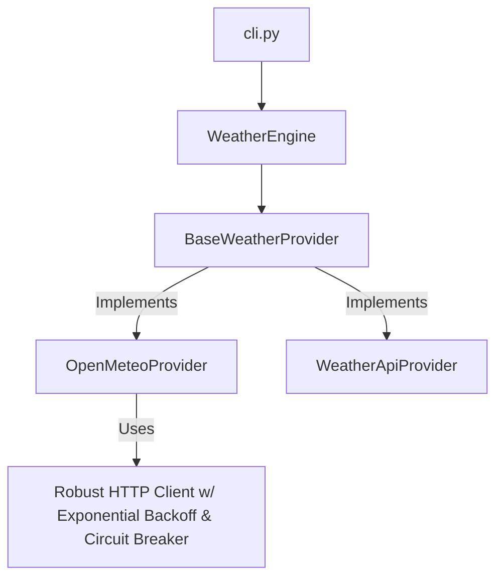
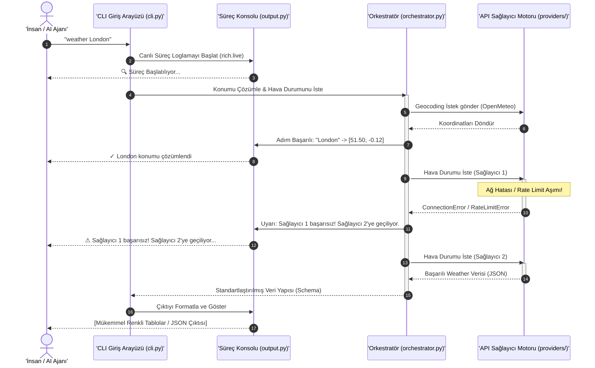

# Proje Yol Haritası: 10x Weather CLI (v1.0.0a)
## Vizyon: Hem İnsanlar için "Wow-Factor" Hem de Yapay Zeka Ajanları için "AI-Native"

Bu doküman, mevcut **Weather CLI** projesini açık kaynak dünyasındaki tüm rakiplerinden **10 kat daha üstün**, görsel olarak büyüleyici (wow-factor) ve yapay zeka ajanları tarafından sıfır hata ile otonom olarak kullanılabilecek (**AI-Native**) bir seviyeye taşımak amacıyla hazırlanmış **8 adet yüksek etkili geliştirme fikrini** içermektedir.

Fikirler, teknik mimariden kullanıcı deneyimine ve otonom entegrasyon kabiliyetine göre **En İyiden En Kötüye (Etki Derecesine Göre)** sıralanmıştır. Sizin belirttiğiniz modüler yapı, orkestratör ve mükemmel görsel loglama modülleri ilk sıralarda temel taş olarak konumlandırılmıştır.

---

## 1. Fikirlerin Karşılaştırma Matrisi

Aşağıdaki tablo, önerilen tüm fikirlerin **İnsan Deneyimi (Wow Factor)**, **Yapay Zeka Uyumluluğu (AI-Native)**, **Geliştirme Zorluğu** ve **Genel Etki Derecesini** özetlemektedir:

| # | Fikir Adı | Wow Factor (İnsan) | AI-Native (Ajan) | Zorluk Derecesi | Genel Etki | Öncelik Sırası |
|---|---|---|---|---|---|---|
| 1 | **Modüler API Motoru & Derin Hata Yönetimi** | 🟡 Orta | 🟢 Çok Yüksek | 🛠️ Orta | 🔴 Kritik | **1. En İyi** |
| 2 | **Çoklu API Orkestratörü & Kesintisiz Uptime** | 🟡 Orta | 🟢 Çok Yüksek | 🛠️ Yüksek | 🔴 Kritik | **2. Çok İyi** |
| 3 | **Görsel Süreç Takipçisi & Canlı Terminal Loglama** | 🟢 Çok Yüksek | 🔴 Düşük (Kapatılabilir) | 🛠️ Orta | 🟢 Yüksek | **3. Çok İyi** |
| 4 | **AI-Native "Headless" Modu & Kendi Kendini Düzeltme**| 🔴 Düşük | 🟢 Çok Yüksek | 🛠️ Kolay | 🟢 Yüksek | **4. İyi** |
| 5 | **Dinamik Yerel Saat Dilimi & Otomatik Birim Çevirici** | 🟢 Yüksek | 🟢 Yüksek | 🛠️ Kolay | 🟢 Yüksek | **5. İyi** |
| 6 | **Fuzzy Arama & İnteraktif Konum Seçim Ekranı** | 🟢 Çok Yüksek | 🟡 Orta | 🛠️ Orta | 🟡 Orta | **6. Orta** |
| 7 | **SQLite Tabanlı Akıllı Çevrimdışı Önbellek (Cache)** | 🟢 Yüksek | 🟢 Yüksek | 🛠️ Yüksek | 🟡 Orta | **7. Orta** |
| 8 | **Hava Durumu Temaları & Dinamik Görsel Sanat** | 🟢 Çok Yüksek | 🔴 Düşük | 🛠️ Orta | 🟡 Orta | **8. Orta** |

---

## 2. Detaylı Fikir Analizleri

### Fikir 1: Modüler API Motoru & Derin Hata Yönetimi (Core Engine)
> [!IMPORTANT]
> **Sizin Fikriniz:** Arka plandaki mantığı modüler, test edilebilir bir yapıya dönüştürür. HTTP istek detaylarını, retry (yeniden deneme) mekanizmalarını ve hata yönetimini tamamen kendi içinde çözer.

* **Teknik Detaylar:**
  - `weather_cli/providers/base.py` altında soyut bir `WeatherProvider` arayüzü tanımlanır.
  - Her hava durumu servisi (`OpenMeteo`, `WeatherAPI`, vb.) bu sınıftan türetilir.
  - İsteklerde `tenacity` benzeri üstel geri çekilme (exponential backoff) algoritması ve hız sınırlamalarını (rate-limiting) aşmamak için akıllı bekleme mekanizmaları entegre edilir.
  - HTTP 429 (Too Many Requests) ve 5xx (Server Error) kodları için özel istisnalar (custom exceptions) fırlatılır.
* **AI-Native Etkisi:** CLI'ı bir kütüphane (SDK) olarak kullanmak isteyen AI ajanları, import ederek temiz veri yapıları elde eder.
* **Mimarideki Yeri (Mermaid):**



---

### Fikir 2: Çoklu API Orkestratörü (API Failback Orchestrator)
> [!IMPORTANT]
> **Sizin Fikriniz:** 3 farklı API modülü arasında koordinasyon sağlar. Bir API çöker veya hata verirse, orkestratör kullanıcıya yansıtmadan diğer alternatif sağlayıcılara geçer ve veriyi kesintisiz sunar.

* **Teknik Detaylar:**
  - `WeatherOrchestrator` adında bir yönetim katmanı oluşturulur.
  - Sağlayıcılar için bir öncelik sırası belirlenir (Örn: 1. OpenMeteo, 2. WeatherAPI, 3. Tomorrow.io).
  - Eğer OpenMeteo 403, 429 veya bağlantı hatası verirse, orkestratör milisaniyeler içinde sessizce WeatherAPI'ye geçer.
  - **Akıllı Veri Harmanlama (Data Blending):** Eğer ana sağlayıcıda bazı alanlar eksikse (örn: rüzgar darbesi veya UV indeksi), eksik alanlar diğer sağlayıcıdan gelen verilerle tamamlanır.
* **AI-Native Etkisi:** Yapay zeka ajanları CLI isteklerinin asla ağ veya rate-limit hatalarıyla yarıda kesilmeyeceğinden emin olur, bu da kararlılığı %99.9'a çıkarır.

---

### Fikir 3: Görsel Süreç Takipçisi & Canlı Terminal Loglama (Wow-Factor Log)
> [!IMPORTANT]
> **Sizin Fikriniz:** Arka planda dönen karmaşık süreçleri (normalizasyon, geocoding, API çağrısı, orkestrasyon) sade, renkli, checklist tarzında, progress bar veya spinner kullanarak canlı olarak terminalde gösterir.

* **Teknik Detaylar:**
  - `rich.live` ve `rich.status` kullanılarak tamamen dinamik bir "Süreç Konsolu" oluşturulur.
  - Terminalde statik loglar basmak yerine, o an yapılan işlem canlı güncellenir.
  - Örnek Arayüz Akışı:
    ```text
    🔍 Süreç Başlatılıyor...
    ⠋ [yellow]Konum çözümleniyor: "Eski İstanbul"[/yellow]
    ✓ [green]Konum çözümlendi: İstanbul, Türkiye (41.01, 28.94)[/green]
    ⠙ [cyan]Hava durumu verisi çekiliyor (Orkestratör Aktif)...[/cyan]
    ⚠ [red]Open-Meteo limiti aşıldı! Alternatif sağlayıcıya (WeatherAPI) geçiliyor...[/red]
    ✓ [green]Veri başarıyla harmanlandı.[/green]
    📊 [bold violet]Grafikler ve tablolar oluşturuluyor...[/bold violet]
    ```
* **Wow-Factor Etkisi:** Kullanıcı uygulamayı çalıştırdığı anda sıradan bir CLI değil, profesyonelce tasarlanmış etkileşimli bir kontrol paneli hissi yaşar.

---

### Fikir 4: AI-Native "Headless" Modu & Hata Düzeltme Kılavuzu
> [!TIP]
> **CLI'ı Kullanan AI Ajanlarını 1. Sınıf Vatandaş Yapın:** AI ajanları terminal çıktılarını regex ile parse etmekte zorlanırlar. Bu özellik ajanların CLI'ı sıfır hata ile kontrol etmesini sağlar.

* **Teknik Detaylar:**
  - `--headless` veya `--machine` bayrağı eklenir. Bu bayrak aktif olduğunda terminale *kesinlikle* renk kodu (ANSI escape sequences), emoji, spinner veya progress bar basılmaz. Sadece temiz, JSON formatında makine verisi basılır.
  - **Self-Correction (Kendi Kendini Düzeltme) Çıktıları:** Bir hata oluştuğunda sadece hata mesajı yazılmaz; hatanın neden kaynaklandığı ve AI ajanının bunu düzeltmek için hangi CLI parametrelerini kullanması gerektiği JSON içinde önerilir:
    ```json
    {
      "status": "error",
      "error_code": "INVALID_DATE_FORMAT",
      "message": "Date must be in YYYY-MM-DD format",
      "remedy_suggestion": "Ensure the --from-date argument is formatted as YYYY-MM-DD (e.g. '2026-05-19'). Do not use slashes or relative names in headless mode."
    }
    ```
* **AI-Native Etkisi:** Yapay zeka ajanları aldıkları hataları anında anlayıp CLI komutlarını kendi kendilerine düzelterek tekrar deneyebilirler.

---

### Fikir 5: Dinamik Yerel Saat Dilimi & Otomatik Birim Çevirici
> [!TIP]
> **Kullanılabilirlik Devrimi:** Şu anki CLI, Open-Meteo'dan dönen saat verilerini doğrudan **UTC** olarak gösteriyor. Bu durum kullanıcılar için ciddi bir kafa karışıklığı yaratıyor.

* **Teknik Detaylar:**
  - Geocoding API'sinden gelen konumun koordinatları kullanılarak `timezonefinder` veya API'den dönen yerel timezone bilgisi üzerinden saatler **hedef konumun yerel saatine** göre dinamik olarak dönüştürülür.
  - Kullanıcının işletim sistemi dili ve konumuna göre otomatik birim tespiti yapılır (Örn: ABD'deki kullanıcıya otomatik Fahrenheit ve mph, Türkiye'deki kullanıcıya Celsius ve km/h gösterilir).
  - `--units imperial` or `--units metric` seçeneğiyle bu davranış tamamen kontrol edilebilir.
* **Wow-Factor Etkisi:** Terminal başlığında saat dilimi şık bir şekilde yazdırılır:
  `📍 Istanbul, Turkey (Yerel Saat: 17:24, GMT+3)`

---

### Fikir 6: Fuzzy Arama & İnteraktif Konum Seçim Ekranı
> [!NOTE]
> **Belirsiz Konum Çözümleme:** Kullanıcı "Springfield" yazdığında şu an CLI ilk sonucu seçiyor. Ancak dünyada onlarca "Springfield" var.

* **Teknik Detaylar:**
  - Eğer geocoding API'sinden birden fazla yakın sonuç dönerse ve CLI interaktif modda çalışıyorsa (`sys.stdout.isatty()` aktifse), terminalde ok tuşlarıyla seçilebilen şık bir interaktif liste açılır:
    ```text
    🤔 Birden fazla konum bulundu! Lütfen ok tuşlarıyla seçin:
    > 📍 Springfield, Illinois, ABD (Popülasyon: 110K)
      📍 Springfield, Missouri, ABD (Popülasyon: 160K)
      📍 Springfield, Massachusetts, ABD (Popülasyon: 150K)
    ```
  - **Ajan Uyumluluğu:** Eğer `--headless` aktifse veya terminal interaktif değilse, interaktif ekran tamamen atlanır, otomatik olarak en popüler olanı seçer veya hata döndürerek seçenekleri JSON içinde listeler.

---

### Fikir 7: SQLite Tabanlı Akıllı Çevrimdışı Önbellek (Offline Cache)
> [!NOTE]
> **Maksimum Hız ve API Kotası Tasarrufu:** Aynı konumu gün içinde defalarca sorgulayan kullanıcılar veya AI ajanları için ağı meşgul etmeden anında yanıt verme kabiliyeti.

* **Teknik Detaylar:**
  - `~/.cache/weather-cli/` dizininde hafif bir SQLite veritabanı tutulur.
  - Geocoding sonuçları (konum -> koordinat) 30 gün boyunca önbelleğe alınır (böylece konum çözümleme 0ms sürer).
  - Hava durumu tahminleri 15-30 dakika boyunca önbelleğe alınır.
  - Önbellekten okunan verilerde terminale küçük, şık bir yıldırım simgesiyle bildirim eklenir:
    `⚡ Önbellekten getirildi (320ms tasarruf sağlandı)`
* **Etkisi:** Uygulamanın tepki süresi 500ms'den **10ms'ye** düşer.

---

### Fikir 8: Hava Durumu Temaları & Dinamik Görsel Sanat
> [!NOTE]
> **Arayüzde Görsel Şölen:** Terminal ekranının sadece renksiz tablolardan ibaret olmasını engeller, hava durumuna göre renk değiştiren temalar sunar.

* **Teknik Detaylar:**
  - `--theme` parametresi eklenir (`dracula`, `nord`, `cyberpunk`, `monokai`).
  - **Dinamik Hava Durumu Teması:** Eğer hedef konumda fırtına varsa terminal arayüzü koyu mor ve neon sarı; kar yağışlıysa buz mavisi; güneşliyse altın sarısı tonlarında parlar.
  - Rich kütüphanesinin çizim yetenekleri kullanılarak sağ veya sol köşede minimalist, şık bir hava durumu ikonu (ASCII art veya yüksek çözünürlüklü Unicode blok sanatı) çizilir.

---

## 3. Mimari Entegrasyon Tasarımı (Mermaid)

Sizin önerdiğiniz **Modüler Yapı**, **Orkestrasyon** ve **Canlı Loglama** bir araya geldiğinde CLI'ın veri akış diyagramı şu şekilde olacaktır:



---

## 4. Sonraki Adımlar & Görüşleriniz

1. **Önceliklendirme:** Bu yol haritasındaki sıralama sizin için uygun mu? Özellikle ilk 3 adım (Modüler Yapı, Orkestrasyon ve Süreç Loglama) üzerinden hemen kodlama aşamasına geçelim mi?
2. **Sağlayıcı Seçimi:** Orkestrasyon modülünde Open-Meteo dışındaki diğer 2 sağlayıcı hangileri olsun? (Önerilenler: *WeatherAPI.com* [ücretsiz API anahtarı veriyor] ve *Tomorrow.io* veya *PirateWeather*).
3. **Loglama Tasarımı:** Canlı süreç loglamasında görmek istediğiniz özel animasyonlar veya checklist formatı hakkında eklemek istedikleriniz var mı?
